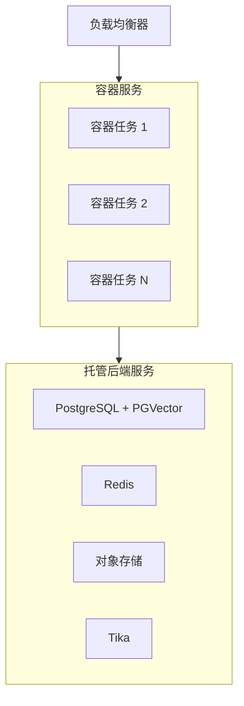

# 容器服务

在 AWS ECS/Fargate、Azure Container Apps 或 Google Cloud Run 等托管容器平台上运行官方 `ghcr.io/open-webui/open-webui` 镜像。

:::info 前置条件
继续之前，请先完成[共享基础设施要求](/enterprise/deployment#shared-infrastructure-requirements)的配置——包括 PostgreSQL、Redis、向量数据库、共享存储和内容提取。
:::

## 何时选择这种模式

- 你希望获得容器带来的优势（不可变镜像、版本化部署、无需管理操作系统），但不想承担 Kubernetes 的复杂度
- 你的组织已经在使用托管容器平台
- 你需要以较低运维开销快速扩缩容
- 你偏好具备平台原生自动扩缩容能力的托管基础设施

## 架构



## 镜像选择

为确保生产稳定性，请使用**版本化标签**：

```
ghcr.io/open-webui/open-webui:v0.x.x
```

不要在生产环境中使用 `:main` 标签——它会跟踪最新开发构建，可能在没有预警的情况下引入破坏性变更。请查看 [Open WebUI releases](https://github.com/open-webui/open-webui/releases) 获取最新稳定版本。

## 扩缩容策略

- **平台原生自动扩缩容**：将容器服务配置为根据 CPU 使用率、内存或请求数扩缩容。
- **健康检查**：使用 `/health` 端点同时作为 liveness 和 readiness 探针。
- **任务级环境变量**：通过任务定义中的环境变量或密钥传入所有共享基础设施配置。
- **会话亲和性**：在负载均衡器上启用 sticky session 以提高 WebSocket 稳定性。虽然 Redis 负责跨实例协调，但会话亲和性可以减少不必要的会话切换。

## 关键注意事项

| 注意事项 | 说明 |
| :--- | :--- |
| **存储** | 使用对象存储（S3、GCS、Azure Blob）或共享文件系统（如 EFS）。容器本地存储是临时性的，且不会在任务之间共享。 |
| **Tika sidecar** | 可将 Tika 作为同一任务定义中的 sidecar 容器运行，也可单独作为服务部署。sidecar 模式可让提取流量保持本地化。 |
| **密钥管理** | 使用平台的密钥管理服务（AWS Secrets Manager、Azure Key Vault、GCP Secret Manager）来保存 `DATABASE_URL`、`REDIS_URL` 和 `WEBUI_SECRET_KEY`。 |
| **更新** | 先执行单任务滚动部署——该任务负责运行迁移（`ENABLE_DB_MIGRATIONS=true`）。健康后，再将其余任务扩容，并设置 `ENABLE_DB_MIGRATIONS=false`。 |

## 需要避免的反模式

| 反模式 | 影响 | 修复方式 |
| :--- | :--- | :--- |
| 使用本地 SQLite | 任务重启时数据丢失，多任务下数据库锁冲突 | 将 `DATABASE_URL` 设置为 PostgreSQL |
| 使用默认 ChromaDB | 基于 SQLite 的向量数据库在多进程访问下会崩溃 | 设置 `VECTOR_DB=pgvector`（或使用 Milvus/Qdrant） |
| `WEBUI_SECRET_KEY` 不一致 | 登录循环、401 错误、会话无法跨任务保持 | 通过密钥管理器为每个任务设置相同的密钥 |
| 未配置 Redis | WebSocket 失败、配置不同步、“Model Not Found” 错误 | 设置 `REDIS_URL` 和 `WEBSOCKET_MANAGER=redis` |

有关容器基础知识，请参阅[快速开始指南](/getting-started/quick-start)。

---

**需要帮助规划企业部署吗？** 我们的团队正在帮助全球组织设计并实施生产级 Open WebUI 环境。

[**联系企业销售 → sales@openwebui.com**](mailto:sales@openwebui.com)
