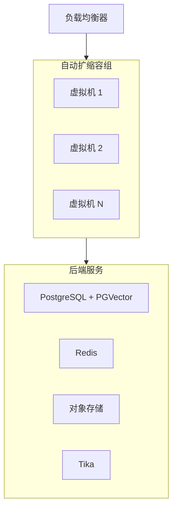

# 虚拟机上的 Python / Pip 自动扩缩容部署

在云自动扩缩容组（AWS ASG、Azure VMSS、GCP MIG）的虚拟机上，以 systemd 管理 `open-webui serve` 进程。

:::info 前置条件
继续之前，请先完成[共享基础设施要求](/enterprise/deployment#shared-infrastructure-requirements)的配置——包括 PostgreSQL、Redis、向量数据库、共享存储和内容提取。
:::

## 何时选择这种模式

- 你的组织已经有成熟的 VM 基础设施和运维实践
- 监管或合规要求需要直接控制操作系统层
- 你的团队容器经验有限，但具备较强的 Linux 运维能力
- 你希望部署方式直接清晰，不引入容器编排额外开销

## 架构



## 安装

在每台 VM 上使用带 `[all]` extra 的 pip 安装（包含 PostgreSQL 驱动）：

```bash
pip install open-webui[all]
```

创建一个 systemd unit 来管理该进程：

```ini
[Unit]
Description=Open WebUI
After=network.target

[Service]
Type=simple
User=openwebui
EnvironmentFile=/etc/open-webui/env
ExecStart=/usr/local/bin/open-webui serve
Restart=always
RestartSec=5

[Install]
WantedBy=multi-user.target
```

将环境变量放入 `/etc/open-webui/env`（参见[关键配置](/enterprise/deployment#critical-configuration)）。

## 扩缩容策略

- **水平扩展**：将自动扩缩容组配置为根据 CPU 使用率或请求数增减 VM。
- **健康检查**：让负载均衡器将 `/health` 作为健康检查端点（健康时返回 HTTP 200）。
- **每台 VM 只运行一个进程**：保持 `UVICORN_WORKERS=1`，由自动扩缩容器负责容量管理。这样可以简化内存核算，并避免默认向量数据库的 fork 安全问题。
- **Sticky sessions**：在负载均衡器上配置基于 Cookie 的会话亲和性，以确保 WebSocket 连接持续路由到同一实例。

## 关键注意事项

| 注意事项 | 说明 |
| :--- | :--- |
| **操作系统补丁** | 你需要自行负责操作系统更新、安全补丁以及 Python 运行时管理。 |
| **Python 环境** | 固定 Python 版本（推荐 3.11），并使用虚拟环境或系统级安装。 |
| **存储** | 由于自动扩缩容组中的 VM 不共享本地文件系统，因此应使用对象存储（如 S3）或共享文件系统（如 NFS）。 |
| **Tika sidecar** | 可在每台 VM 上运行 Tika 服务，也可以作为共享服务部署。共享实例更易于统一管理。 |
| **更新** | 将实例组缩容到 1 个实例，更新软件包（`pip install --upgrade open-webui`），等待数据库迁移完成，再扩回原规模。 |

有关 pip 安装基础，请参阅[快速开始指南](/getting-started/quick-start)。

---

**需要帮助规划企业部署吗？** 我们的团队正在帮助全球组织设计并实施生产级 Open WebUI 环境。

[**联系企业销售 → sales@openwebui.com**](mailto:sales@openwebui.com)
