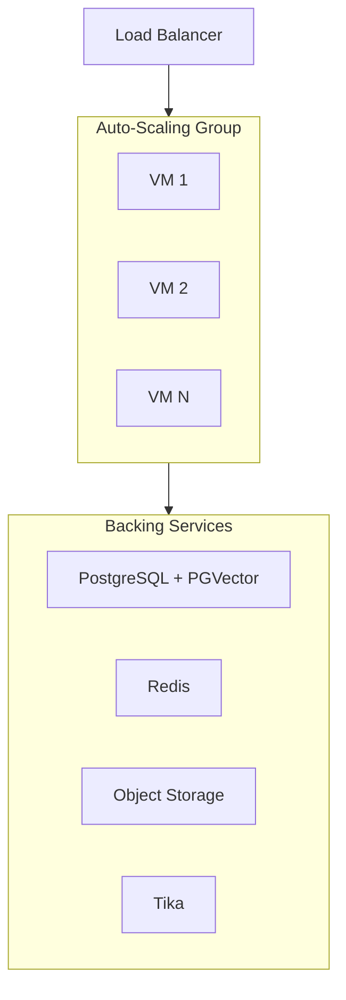

# 自动扩缩容虚拟机上的 Python / Pip

将 `open-webui serve` 以 systemd 管理的进程形式，部署在云自动扩缩容虚拟机组（AWS ASG、Azure VMSS、GCP MIG）中。

:::info 前置条件
继续之前，请先确认你已经配置好了[共享基础设施要求](/enterprise/deployment#shared-infrastructure-requirements)——包括 PostgreSQL、Redis、向量数据库、共享存储和内容提取服务。
:::

## 何时选择这种模式

- 你的组织已经具备成熟的 VM 基础设施和运维实践
- 监管或合规要求你必须进行操作系统层直接控制
- 团队容器经验有限，但 Linux 运维能力较强
- 你希望采用更直接的部署方式，而不引入容器编排开销

## 架构



## 安装

在每台 VM 上通过带 `[all]` 扩展的 pip 安装（包含 PostgreSQL 驱动）：

```bash
pip install open-webui[all]
```

创建一个 systemd unit 来管理该进程：

```ini
[Unit]
Description=Open WebUI
After=network.target

[Service]
Type=simple
User=openwebui
EnvironmentFile=/etc/open-webui/env
ExecStart=/usr/local/bin/open-webui serve
Restart=always
RestartSec=5

[Install]
WantedBy=multi-user.target
```

将环境变量放在 `/etc/open-webui/env` 中（参见 [Critical Configuration](/enterprise/deployment#critical-configuration)）。

## 扩展策略

- **横向扩展**：让自动扩缩容组根据 CPU 利用率或请求数增减 VM。
- **健康检查**：将负载均衡器健康检查指向 `/health` 端点（健康时返回 HTTP 200）。
- **每台 VM 一个进程**：保持 `UVICORN_WORKERS=1`，把容量管理交给自动扩缩容系统。这样可以简化内存核算，并避免默认向量数据库的 fork 安全问题。
- **Sticky Sessions**：在负载均衡器上配置基于 Cookie 的会话亲和性，确保 WebSocket 连接持续路由到同一实例。

## 关键注意事项

| 注意事项 | 说明 |
| :--- | :--- |
| **OS 补丁** | 你需要自行负责操作系统更新、安全补丁和 Python 运行环境管理。 |
| **Python 环境** | 固定 Python 版本（推荐 3.11），并使用虚拟环境或系统级安装。 |
| **存储** | 由于自动扩缩容组中的 VM 不共享本地文件系统，因此应使用对象存储（如 S3）或共享文件系统（如 NFS）。 |
| **Tika Sidecar** | 可以在每台 VM 上运行 Tika 服务，也可以作为共享服务单独运行。共享实例更便于管理。 |
| **更新** | 先把实例组缩容到 1 台，执行包更新（`pip install --upgrade open-webui`），等待数据库迁移完成，再扩容回来。 |

pip 基础安装方式可参考 [Quick Start guide](/getting-started/quick-start)。

---

**需要帮助规划企业部署？** 我们的团队正与全球组织合作，共同设计和落地生产级 Open WebUI 环境。

[**联系企业销售 → sales@openwebui.com**](mailto:sales@openwebui.com)
