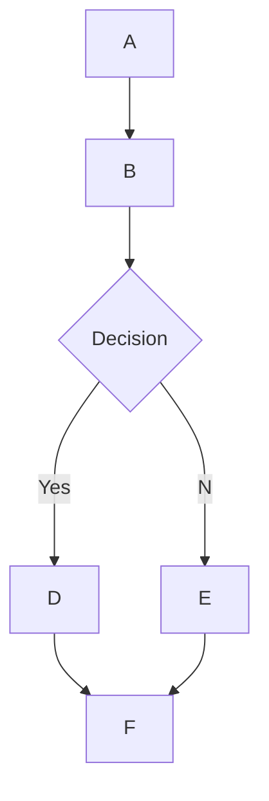

## 🌊 Open WebUI 中的 MermaidJS 渲染支持

## 概览

Open WebUI 支持在聊天界面中直接渲染美观的 MermaidJS 图表、流程图、饼图等内容。MermaidJS 是一个非常强大的复杂信息与思路可视化工具，而当它与大语言模型（LLM）的能力结合时，也会成为生成与探索新想法的有力助手。

## 在 Open WebUI 中使用 MermaidJS

若要生成 MermaidJS 图表，你只需在任意聊天中要求 LLM 使用 MermaidJS 创建图表或流程图。例如，你可以让 LLM：

- “Create a flowchart for a simple decision-making process for me using Mermaid. Explain how the flowchart works.”
- “Use Mermaid to visualize a decision tree to determine whether it's suitable to go for a walk outside.”

请注意，若要让 LLM 的回复被正确渲染，其输出必须以 `mermaid` 开头，后面紧跟 MermaidJS 代码。你可以参考 [MermaidJS documentation](https://mermaid.js.org/intro/) 以确保语法正确，也可以给 LLM 提供更结构化的提示词，引导它生成质量更高的 MermaidJS 语法。

## 在聊天中直接可视化 MermaidJS 代码

当你请求 MermaidJS 可视化时，大语言模型（LLM）会生成所需代码。只要代码使用了有效的 MermaidJS 语法，Open WebUI 就会自动在聊天界面中渲染出对应图形。

如果模型生成了 MermaidJS 语法，但图没有成功渲染，通常说明代码里存在语法错误。别担心——回复完整生成后，系统会提示你相关错误。如果发生这种情况，请参考 [MermaidJS documentation](https://mermaid.js.org/intro/) 查找问题，并据此调整提示词。

## 与可视化结果交互

一旦图形显示出来，你可以：

- 放大或缩小，以便更仔细地查看
- 点击显示区域右上角的复制按钮，复制生成该图形所使用的原始 MermaidJS 代码

### 示例



这会生成类似下面的流程图：

```markdown
 startAncestor [ start ]
A[A] --> B[B]
B --> C[Decision]
C -->| Yes | D[D]
C -->| No  | E[E]
D --> F[F]
E --> F[F]
```

尝试不同类型的图表和图形，有助于你更细致地理解如何在 Open WebUI 中高效利用 MermaidJS。对于较小模型，你可以考虑引用 [MermaidJS documentation](https://mermaid.js.org/intro/) 来为 LLM 提供指导，或者让它先将文档总结为系统提示词或结构化笔记。通过这些方式并持续探索 MermaidJS 的能力，你就能在 Open WebUI 中释放这一强大工具的全部潜力。
