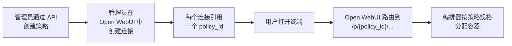
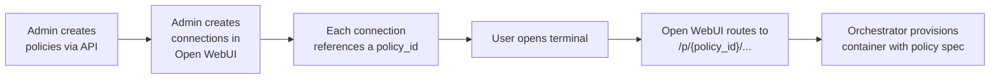

# 策略

策略是具名的环境配置，定义了终端容器的外观：镜像、资源限制、存储、环境变量和空闲超时时间。它们允许你从单个编排器向不同团队提供不同的终端环境。

例如，你可以创建一个带有大型镜像、4 个 CPU 核心和 16 GiB 内存的 `data-science` 策略，同时创建一个使用默认精简镜像、1 个 CPU 和 2 GiB 内存的 `development` 策略。

---

## 策略工作原理



1. **管理员通过 REST API 在编排器上创建策略**（见下方 [API 参考](#api-参考)）。
2. **管理员在 Open WebUI 中创建终端连接**（位于 **Settings → Connections → Open Terminal**）。每个连接包含一个 `policy_id` 字段，将其映射到编排器上的某个策略。
3. **用户打开终端。** Open WebUI 通过 `/p/{policy_id}/...` 路由请求，编排器按该策略的规格分配（或复用）容器。

每个用户每个策略各自有独立的隔离容器。如果一个用户可以访问两个使用不同策略的连接，他们会获得两个独立的终端。

---

## 策略字段

所有字段均为可选。当字段缺省时，编排器回退到全局默认值（通过环境变量设置）。

| 字段 | 类型 | 默认值 | 说明 |
| :--- | :--- | :--- | :--- |
| `image` | string | `TERMINALS_IMAGE` · `ghcr.io/open-webui/open-terminal:latest` | 运行的容器镜像 |
| `cpu_limit` | string | 无限制 | 最大 CPU（例如 `"2"`、`"500m"`） |
| `memory_limit` | string | 无限制 | 最大内存（例如 `"4Gi"`、`"512Mi"`） |
| `storage` | string | 无（临时） | 持久卷大小（例如 `"10Gi"`）。缺省时，容器使用临时存储，容器删除后数据丢失。 |
| `storage_mode` | string | `TERMINALS_KUBERNETES_STORAGE_MODE` · `per-user` | 持久卷的分配方式：`per-user`、`shared` 或 `shared-rwo`。参见[存储模式](#存储模式)。仅适用于 Kubernetes 后端。 |
| `env` | object | `{}` | 注入容器的键值对环境变量 |
| `idle_timeout_minutes` | integer | `TERMINALS_IDLE_TIMEOUT_MINUTES` · `0`（禁用） | 容器在不活动多少分钟后被停止并删除 |

### 存储模式

`storage_mode` 字段控制 Kubernetes 后端上持久卷的分配方式。对 Docker 后端无效（Docker 后端始终 bind-mount 宿主目录）。

| 模式 | 行为 | PVC 访问模式 |
| :--- | :--- | :--- |
| `per-user` | 每个用户有自己的 PVC。完全隔离。 | ReadWriteOnce |
| `shared` | 所有用户共享一个 PVC，每个用户的数据存储在以其用户 ID 为 `subPath` 的目录下。需要支持 ReadWriteMany 的存储类（如 NFS、EFS）。 | ReadWriteMany |
| `shared-rwo` | 共享一个 ReadWriteOnce PVC。所有终端 Pod 通过 Pod 亲和性被调度到同一节点（Kubernetes 确保它们都落在挂载了该卷的机器上）。适用于没有 ReadWriteMany 存储的场景。 | ReadWriteOnce |

**ReadWriteOnce（RWO）** 意味着卷一次只能被单个节点上的 Pod 挂载。**ReadWriteMany（RWX）** 意味着多个节点可以同时挂载并写入该卷。

### 环境变量

`env` 字段向终端容器注入任意键值对作为环境变量。常见用途：

- **API Key：** 为用户提供访问 LLM API、云服务等的权限。
- **出站过滤：** 设置 `OPEN_TERMINAL_ALLOWED_DOMAINS` 以限制出站网络访问（例如 `"*.pypi.org,github.com"`）。当该变量存在时，Docker 后端会自动为容器添加 `NET_ADMIN` 能力。
- **自定义配置：** 你的终端镜像支持的任何设置

:::warning
策略中的环境变量对终端用户可见（他们可以在 shell 中运行 `env`）。不要在此处存储用户不应看到的密钥。
:::

---

## 管理策略

策略可在 Open WebUI 管理面板的 **Settings → Connections → Open Terminal** 下进行管理。在那里你可以创建、编辑和删除策略，将其分配给终端连接，并按组限制访问。

:::info
更新策略不会影响正在运行的终端。新规格在该策略下次分配容器时生效（例如，旧容器因空闲超时被清理或手动删除后）。
:::

---

## 将策略连接到 Open WebUI

一旦策略在编排器上存在，就可以在 Open WebUI 中将其连接起来，使用户可以访问。

### 1. 添加终端连接

在 Open WebUI 管理面板中，进入 **Settings → Connections** 并添加 Open Terminal 连接：

| 字段 | 值 |
| :--- | :--- |
| **URL** | 编排器的 URL（例如 `http://terminals-orchestrator:3000`） |
| **API Key** | 编排器的 `TERMINALS_API_KEY` |
| **Policy ID** | 你创建的策略名称（例如 `data-science`） |

保存后，Open WebUI 会将该连接的所有请求通过编排器上的 `/p/data-science/...` 路由。

### 2. 通过组限制访问

每个终端连接都支持**访问授权**，用于控制哪些用户或组可以看到它。这让你能够向不同团队提供不同的策略：

```json
[
  {
    "url": "http://orchestrator:3000",
    "key": "sk-...",
    "policy_id": "development",
    "config": {
      "access_grants": [
        { "principal_type": "group", "principal_id": "engineering", "permission": "read" }
      ]
    }
  },
  {
    "url": "http://orchestrator:3000",
    "key": "sk-...",
    "policy_id": "data-science",
    "config": {
      "access_grants": [
        { "principal_type": "group", "principal_id": "data-team", "permission": "read" }
      ]
    }
  }
]
```

在此示例中，工程组只能看到 `development` 终端，而数据团队只能看到 `data-science` 终端。同时属于两个组的用户可以看到两者。

---

## 全局资源限制

管理员可以在编排器上设置全局限制，对策略值进行**约束**，防止任何策略超出允许的最大值。这些限制通过编排器本身的环境变量设置：

| 环境变量 | 示例 | 说明 |
| :--- | :--- | :--- |
| `TERMINALS_MAX_CPU` | `8` | 任何策略可申请的最大 CPU。超出的策略会被静默约束为此值。 |
| `TERMINALS_MAX_MEMORY` | `32Gi` | 任何策略可申请的最大内存 |
| `TERMINALS_MAX_STORAGE` | `100Gi` | 任何策略可申请的最大持久存储 |
| `TERMINALS_ALLOWED_IMAGES` | `ghcr.io/open-webui/*,gcr.io/my-org/*` | 逗号分隔的 glob 模式。若设置，策略的 `image` 必须匹配其中至少一个模式，否则请求将被拒绝（HTTP 400）。 |

这些限制在策略创建和更新时强制执行。如果策略的 `cpu_limit` 为 `"16"` 但 `TERMINALS_MAX_CPU` 为 `"8"`，存储的值会被静默约束为 `"8"`。

:::tip
全局资源限制为平台管理员提供了安全保障。他们可以将策略创建权限委派给团队负责人，同时确保没有任何单个策略会消耗过多的集群资源。
:::

---

## "default" 策略

如果你尚未创建任何策略，也无需创建。编排器使用其全局环境变量作为有效默认值开箱即用：

| 设置 | 环境变量 |
| :--- | :--- |
| 镜像 | `TERMINALS_IMAGE` |
| 空闲超时 | `TERMINALS_IDLE_TIMEOUT_MINUTES` |
| 存储模式 | `TERMINALS_KUBERNETES_STORAGE_MODE` |

当 Open WebUI 中的终端连接未设置 `policy_id`（或编排器收到不带 `/p/` 前缀的请求）时，此零配置回退会生效。无需数据库条目；它等同于单策略部署。

如果你后续在数据库中创建了名为 `default` 的策略，其字段会与全局设置合并（策略值优先）。

---

<details>
<summary>API 参考（用于程序化访问）</summary>

所有端点均以编排器上的 `/api/v1` 为前缀，并需要 `Authorization: Bearer {TERMINALS_API_KEY}` 标头。

| 方法 | 端点 | 说明 |
| :--- | :--- | :--- |
| `GET` | `/policies` | 列出所有策略 |
| `POST` | `/policies` | 创建新策略（请求体：`{ "id": "...", "data": { ... } }`）。若已存在则返回 409。 |
| `GET` | `/policies/{policy_id}` | 获取单个策略 |
| `PUT` | `/policies/{policy_id}` | 创建或更新策略（请求体：`PolicyData` 字段） |
| `DELETE` | `/policies/{policy_id}` | 删除策略 |

### 请求体：PolicyData

```json
{
  "image": "ghcr.io/open-webui/open-terminal:latest",
  "cpu_limit": "4",
  "memory_limit": "16Gi",
  "storage": "20Gi",
  "storage_mode": "per-user",
  "env": { "KEY": "value" },
  "idle_timeout_minutes": 60
}
```

所有字段均为可选。省略的字段继承编排器的全局默认值。

### 响应体：PolicyResponse

```json
{
  "id": "data-science",
  "data": {
    "image": "ghcr.io/open-webui/open-terminal:latest",
    "cpu_limit": "4",
    "memory_limit": "16Gi",
    "storage": "20Gi",
    "env": { "OPEN_TERMINAL_ALLOWED_DOMAINS": "*.pypi.org" },
    "idle_timeout_minutes": 60
  },
  "created_at": "2025-06-01T12:00:00",
  "updated_at": "2025-06-01T12:00:00"
}
```

</details>

---

## 示例：多团队配置

一家公司有三个团队（工程、数据科学和实习生），希望提供不同的终端环境。

### 1. 在 Open WebUI 中创建策略

在管理面板的 **Settings → Connections → Open Terminal** 下，创建三个策略：

| 策略 | 镜像 | CPU | 内存 | 存储 | 空闲超时 |
| :--- | :--- | :--- | :--- | :--- | :--- |
| `engineering` | 默认 | 2 | 4Gi | 10Gi | 120 分钟 |
| `data-science` | 自定义数据科学镜像 | 8 | 32Gi | 50Gi | 60 分钟 |
| `intern` | 默认 | 1 | 1Gi | 无 | 15 分钟 |

### 2. 创建终端连接

添加三个连接，每个连接指向相同的编排器 URL，但使用不同的 `policy_id` 值：`engineering`、`data-science` 和 `intern`。

### 3. 分配组

对每个连接使用访问授权来限制可见范围：

- **工程连接** → `engineering` 组
- **数据科学连接** → `data-science` 组
- **实习生连接** → `interns` 组

`engineering` 组的用户只能看到工程终端。数据科学家只能看到他们自己的终端。实习生获得有限的资源，并在 15 分钟不活动后自动清理。

For example, you might create a `data-science` policy with a large image, 4 CPU cores, and 16 GiB of memory, while a `development` policy uses the default slim image with 1 CPU and 2 GiB.

---

## How policies work



1. **Admin creates policies** on the orchestrator via its REST API (see [API reference](#api-reference) below).
2. **Admin creates terminal connections** in Open WebUI under **Settings → Connections → Open Terminal**. Each connection includes a `policy_id` field that maps it to a policy on the orchestrator.
3. **Users open a terminal.** Open WebUI routes the request through `/p/{policy_id}/...`, and the orchestrator provisions (or reuses) a container matching that policy's spec.

Each user gets their own isolated container per policy. If a user has access to two connections with different policies, they get two independent terminals.

---

## Policy fields

All fields are optional. When a field is omitted, the orchestrator falls back to its global default (set via environment variables).

| Field | Type | Default | Description |
| :--- | :--- | :--- | :--- |
| `image` | string | `TERMINALS_IMAGE` · `ghcr.io/open-webui/open-terminal:latest` | Container image to run |
| `cpu_limit` | string | No limit | Maximum CPU (e.g., `"2"`, `"500m"`) |
| `memory_limit` | string | No limit | Maximum memory (e.g., `"4Gi"`, `"512Mi"`) |
| `storage` | string | None (ephemeral) | Persistent volume size (e.g., `"10Gi"`). When absent, the container uses ephemeral storage that is lost when the container is removed. |
| `storage_mode` | string | `TERMINALS_KUBERNETES_STORAGE_MODE` · `per-user` | How persistent volumes are provisioned: `per-user`, `shared`, or `shared-rwo`. See [Storage modes](#storage-modes). Only applies to Kubernetes backends. |
| `env` | object | `{}` | Key-value environment variables injected into the container |
| `idle_timeout_minutes` | integer | `TERMINALS_IDLE_TIMEOUT_MINUTES` · `0` (disabled) | Minutes of inactivity before the container is stopped and removed |

### Storage modes

The `storage_mode` field controls how persistent volumes are allocated on Kubernetes backends. It has no effect on the Docker backend (which always bind-mounts a host directory).

| Mode | Behavior | PVC access mode |
| :--- | :--- | :--- |
| `per-user` | Each user gets their own PVC. Full isolation. | ReadWriteOnce |
| `shared` | A single PVC is shared by all users, with each user's data in a `subPath` under their user ID. Requires a storage class that supports ReadWriteMany (e.g., NFS, EFS). | ReadWriteMany |
| `shared-rwo` | A single ReadWriteOnce PVC is shared. All terminal pods are scheduled to the same node via pod affinity (Kubernetes ensures they all land on the machine that has the volume mounted). Useful when ReadWriteMany storage is unavailable. | ReadWriteOnce |

**ReadWriteOnce (RWO)** means the volume can only be mounted by pods on a single node at a time. **ReadWriteMany (RWX)** means multiple nodes can mount and write to the volume simultaneously.

### Environment variables

The `env` field injects arbitrary key-value pairs as environment variables in the terminal container. Common uses:

- **API keys:** give users access to LLM APIs, cloud services, etc.
- **Egress filtering:** set `OPEN_TERMINAL_ALLOWED_DOMAINS` to restrict outbound network access (e.g., `"*.pypi.org,github.com"`). When this variable is present, the Docker backend automatically adds the `NET_ADMIN` capability to the container.
- **Custom configuration:** any setting your terminal image supports

:::warning
Environment variables in a policy are visible to the terminal user (they can run `env` in the shell). Do not store secrets here that users should not see.
:::

---

## Managing policies

Policies are managed from the Open WebUI admin panel under **Settings → Connections → Open Terminal**. From there you can create, edit, and delete policies, assign them to terminal connections, and restrict access by group.

:::info
Updating a policy does not affect running terminals. The new spec applies the next time a container is provisioned for that policy (e.g., after the old one is reaped by idle timeout or manually deleted).
:::

---

## Connecting policies to Open WebUI

Once a policy exists on the orchestrator, you wire it up in Open WebUI so users can reach it.

### 1. Add a terminal connection

In the Open WebUI admin panel, go to **Settings → Connections** and add an Open Terminal connection:

| Field | Value |
| :--- | :--- |
| **URL** | The orchestrator's URL (e.g., `http://terminals-orchestrator:3000`) |
| **API Key** | The orchestrator's `TERMINALS_API_KEY` |
| **Policy ID** | The policy name you created (e.g., `data-science`) |

When you save, Open WebUI routes all requests for this connection through `/p/data-science/...` on the orchestrator.

### 2. Restrict access with groups

Each terminal connection supports **access grants** that control which users or groups can see it. This lets you offer different policies to different teams:

```json
[
  {
    "url": "http://orchestrator:3000",
    "key": "sk-...",
    "policy_id": "development",
    "config": {
      "access_grants": [
        { "principal_type": "group", "principal_id": "engineering", "permission": "read" }
      ]
    }
  },
  {
    "url": "http://orchestrator:3000",
    "key": "sk-...",
    "policy_id": "data-science",
    "config": {
      "access_grants": [
        { "principal_type": "group", "principal_id": "data-team", "permission": "read" }
      ]
    }
  }
]
```

In this example, the engineering group sees only the `development` terminal, while the data team sees only the `data-science` terminal. A user who belongs to both groups would see both.

---

## Global Resource Limits

Administrators can set global limits on the orchestrator that **clamp** policy values, preventing any policy from exceeding the allowed maximums. These are set as environment variables on the orchestrator itself:

| Environment variable | Example | Description |
| :--- | :--- | :--- |
| `TERMINALS_MAX_CPU` | `8` | Maximum CPU any policy can request. Policies requesting more are silently clamped to this value. |
| `TERMINALS_MAX_MEMORY` | `32Gi` | Maximum memory any policy can request |
| `TERMINALS_MAX_STORAGE` | `100Gi` | Maximum persistent storage any policy can request |
| `TERMINALS_ALLOWED_IMAGES` | `ghcr.io/open-webui/*,gcr.io/my-org/*` | Comma-separated glob patterns. If set, a policy's `image` must match at least one pattern or the request is rejected with HTTP 400. |

These limits are enforced at policy creation and update time. If a policy's `cpu_limit` is `"16"` but `TERMINALS_MAX_CPU` is `"8"`, the stored value is silently clamped to `"8"`.

:::tip
Global resource limits give platform administrators a safety net. They can delegate policy creation to team leads while ensuring no single policy can consume an unreasonable amount of cluster resources.
:::

---

## The "default" policy

If you haven't created any policies, you don't need to. The orchestrator works out of the box using its global environment variables as the effective default:

| Setting | Environment variable |
| :--- | :--- |
| Image | `TERMINALS_IMAGE` |
| Idle timeout | `TERMINALS_IDLE_TIMEOUT_MINUTES` |
| Storage mode | `TERMINALS_KUBERNETES_STORAGE_MODE` |

This zero-config fallback applies when a terminal connection in Open WebUI has no `policy_id` set (or the orchestrator receives a request without a `/p/` prefix). No database entry is needed; it's equivalent to a single-policy deployment.

If you later create a policy named `default` in the database, its fields are merged with the global settings (policy values take precedence).

---

<details>
<summary>API reference (for programmatic access)</summary>

All endpoints are prefixed with `/api/v1` on the orchestrator and require the `Authorization: Bearer {TERMINALS_API_KEY}` header.

| Method | Endpoint | Description |
| :--- | :--- | :--- |
| `GET` | `/policies` | List all policies |
| `POST` | `/policies` | Create a new policy (body: `{ "id": "...", "data": { ... } }`). Returns 409 if it already exists. |
| `GET` | `/policies/{policy_id}` | Get a single policy |
| `PUT` | `/policies/{policy_id}` | Create or update a policy (body: `PolicyData` fields) |
| `DELETE` | `/policies/{policy_id}` | Delete a policy |

### Request body: PolicyData

```json
{
  "image": "ghcr.io/open-webui/open-terminal:latest",
  "cpu_limit": "4",
  "memory_limit": "16Gi",
  "storage": "20Gi",
  "storage_mode": "per-user",
  "env": { "KEY": "value" },
  "idle_timeout_minutes": 60
}
```

All fields are optional. Omitted fields inherit from the orchestrator's global defaults.

### Response body: PolicyResponse

```json
{
  "id": "data-science",
  "data": {
    "image": "ghcr.io/open-webui/open-terminal:latest",
    "cpu_limit": "4",
    "memory_limit": "16Gi",
    "storage": "20Gi",
    "env": { "OPEN_TERMINAL_ALLOWED_DOMAINS": "*.pypi.org" },
    "idle_timeout_minutes": 60
  },
  "created_at": "2025-06-01T12:00:00",
  "updated_at": "2025-06-01T12:00:00"
}
```

</details>

---

## Example: multi-team setup

A company with three teams (Engineering, Data Science, and Interns) wants different terminal environments.

### 1. Create policies in Open WebUI

In the admin panel under **Settings → Connections → Open Terminal**, create three policies:

| Policy | Image | CPU | Memory | Storage | Idle timeout |
| :--- | :--- | :--- | :--- | :--- | :--- |
| `engineering` | Default | 2 | 4Gi | 10Gi | 120 min |
| `data-science` | Custom data science image | 8 | 32Gi | 50Gi | 60 min |
| `intern` | Default | 1 | 1Gi | None | 15 min |

### 2. Create terminal connections

Add three connections, each pointing to the same orchestrator URL but with different `policy_id` values: `engineering`, `data-science`, and `intern`.

### 3. Assign groups

Use access grants on each connection to restrict visibility:

- **Engineering connection** → `engineering` group
- **Data Science connection** → `data-science` group
- **Intern connection** → `interns` group

Users in the `engineering` group see only the Engineering terminal. Data scientists see only theirs. Interns get limited resources with auto-cleanup after 15 minutes of inactivity.
